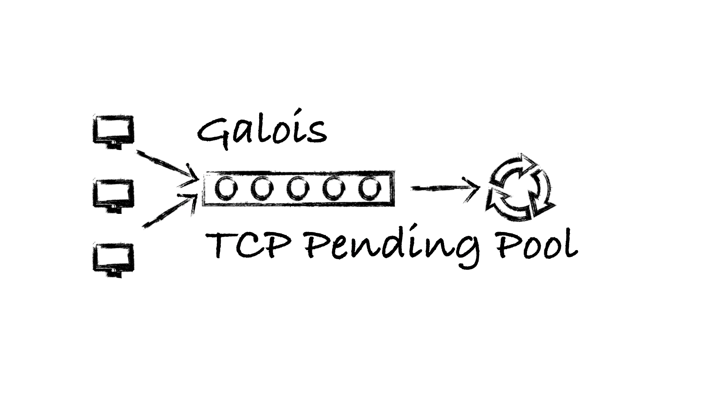

# 1.what's gpendingpool 

gpendingpool是一个TCP连接池通用库，主要目的是接管服务底层TCP连接管理功能，自动对所有连接进行排队控制、超时关闭，异常过滤以及流量控制(限流)，从而向下游交付可用的连接。

# 2.why gpendingpool

众所周知，服务端的网络模块经常需要通过IO多路复用来同时处理多个连接请求，多路复用本身使用细节繁琐容易出错，且由于外部各种原因，难免发生下面几种情况：

* 连接太多，加重select负担从而拖慢系统性能

* 异常连接，TCP三次握手后未收到任何数据，消耗socket

* 流量风暴，短时间内收到大量请求，加重系统负担

针对上述问题，gpendingpool可以完成以下任务

* 接管服务底层的多路复用控制功能，自动监听并管理listenfd\clientfd

* 对所有连接进行监控，如果在规定时间内没有任何后续操作，则主动关闭连接，避免空耗系统资源

* 对readable的连接进行排队，按照FIFO的规则交付给下游，保证连接处理的公平性

* 使用[Token bucket](https://en.wikipedia.org/wiki/Token_bucket)算法对流量进行限制

* 无论连接是否readable，在交付下游时统一做连接可用性检测，主动关闭“读半边关闭”的连接，避免不可用的连接交付给下游。


# 3.quick start

## download

gpendingpool是galois-advertising项目的一个子模块，所以依赖于common库。主要依赖于common中的日志接口和socket相关的一些封装函数。

```shell
$ git clone git@github.com:galois-advertising/gpendingpool.git
$ cd gpendingpool 
$ git submodule init
$ git submodule update
```

或者

```shell
$ git clone --recursive git@github.com:galois-advertising/gpendingpool.git
$ cd gpendingpool 
```

## complier & run demo 

```shell
$ mkdir build & cd build 
$ cmake ..
$ make 
./gpendingpool_demo
```

## test 

```shell
$ nc 127.0.0.1 8709
//send something or ctrl-c to kill connection
```

# 4.integration into your project

在使用cmake构建的项目中，可以很方便的将gpendingpool集成为项目的一个模块。

## add git submodule

```
$ git submodule add -b master https://github.com/galois-advertising/common
$ git submodule add -b master https://github.com/galois-advertising/gpendingpool
```

## rewrite your CMakeLists.txt

```cmake
IF (NOT TARGET common)
    ADD_SUBDIRECTORY(common)
ENDIF()
IF (NOT TARGET gpendingpool)
    ADD_SUBDIRECTORY(gpendingpool)
ENDIF()
INCLUDE_DIRECTORIES("${CMAKE_SOURCE_DIR}/gpendingpool/include")
```

这样项目在编译时会自动对common和gpendingpool下的内容进行编译，生成libcommon.a和libgpendingpool.a两个静态库。

## include gpendingpool.h

```cpp
#include "gpendingpool.h"
int main()
{
    galois::gpendingpool pdp;
    pdp.start();
    int cnt = 3;
    while (cnt--) {
        auto res = pdp.ready_queue_pop(3s);
    }
    pdp.stop();
    return 0;
}
```

## link gpendingpool

```cmake
TARGET_LINK_LIBRARIES(your_target common gpendingpool)
```

# 5.api

gpendingpool通过override来获取配置参数，所以在使用gpendingpool之前，需要先重新实现配置接口，从而自定义配置。

 ```cpp
class my_pendingpool : public galois::gpendingpool {
public:
    unsigned int get_listen_port() const { return 8909;}
    unsigned int get_queue_len() const { return 5; }
    int get_alive_timeout_ms() const { return 4000; }
    int get_queuing_timeout_ms() const { return 4000; }
    int get_select_timeout_ms() const { return 1000; }
    size_t get_max_ready_queue_len() const { return 128; }
};
 ```
gpendingpool有6个参数

* get_listen_port: 监听端口

* get_queue_len: 内核应为相应套接字排队的最大连接个数,listen函数的第二个参数

* get_alive_timeout_ms: 连接在readable之前的最大存活时间

* get_queuing_timeout_ms: 连接在排队等待时的最大存活时间

* get_select_timeout_ms: select函数超时时间，每当select因为超时而被唤醒，就会依此检查unreadable的连接是否超时，并且删除超时连接。

* get_max_ready_queue_len: 系统readable连接队列的最大长度


gpendingpool最关键的用户接口有三个start、stop、ready_queue_pop。

- start：启动监听
- stop：停止监听
- ready_queue_pop：获取一个可用的连接。返回一个optional的结果，其中first为socket，second为该socket连接的时间点，方便后续进行下一步超时控制。其中参数time_out为一个超时时间，防止程序睡死。


